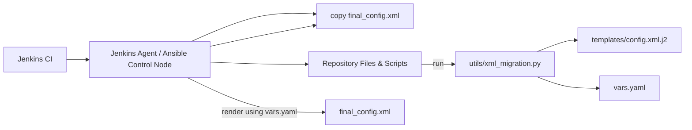
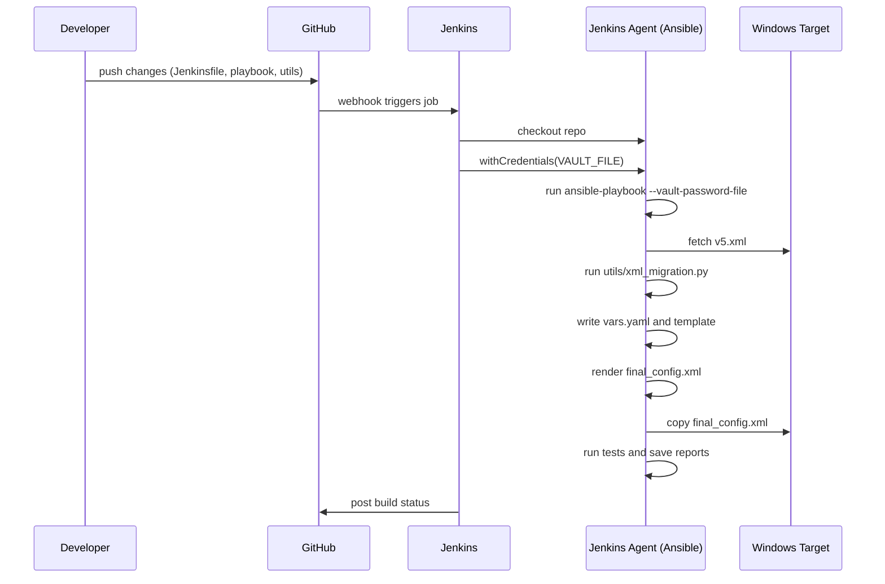

# Architecture and Sequence Diagrams (Mermaid)

## System architecture

## Sequence diagram

## How to view locally
- In Markdown viewers that support Mermaid (VS Code with Mermaid preview, GitHub after rendering), these diagrams will render automatically.
